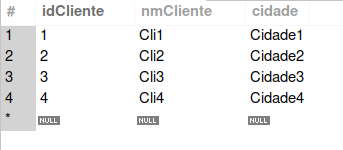
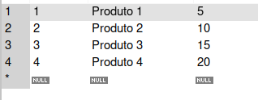
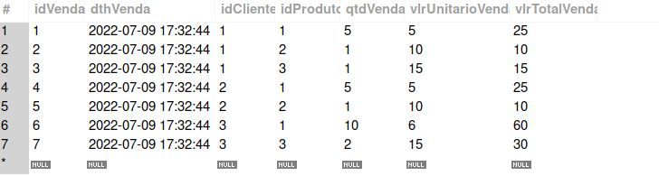

#
CrudCD

##
Este projeto é um Crud de Clientes, Produtos e Vendas.

###
Dependências:
   - NodeJs v16
   - Docker v20
   - Docker-compose v1.29

###
Tecnologias:
  - backend:
    - Typescript
    - SequelizeORM
    - MySql
    - Mocha, Chai, Sinon

  - frontend:
    - React
    - Javascript
    - HTML
    - CSS(WIP)

####
Execução:
  Após instalação das dependências, na pasta raiz do projeto rodar ```npm start```.
  
  Para verificar a execução do frontend: ```http://localhost:3000```.
  
  Para parar a execução dos containers: ```npm run compose:down```, na pasta raiz do projeto.

####
Seeders:
  
  
  
  


####
Explicação do projeto: 
WIP
